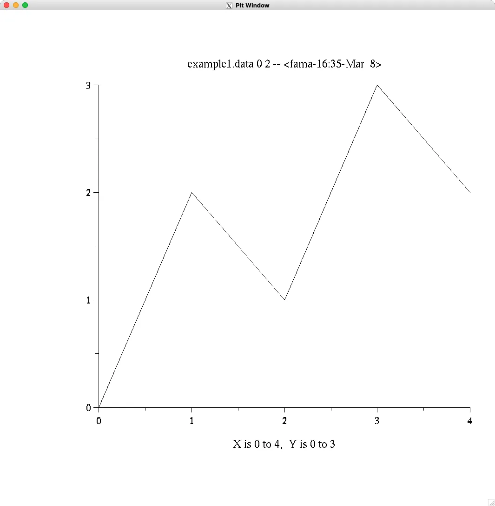
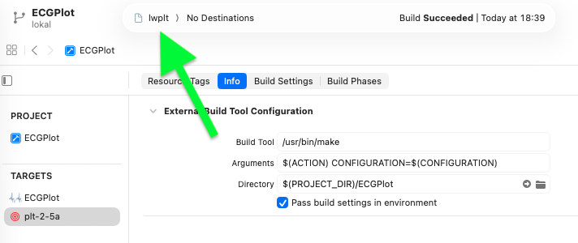

# macOS Patch für `plt` - Software für 2D-Plots

Gepatchte Quellcodes aus dem Projekt [https://physionet.org/content/plt/2.5/plt-2.5a.tar.gz](https://physionet.org/content/plt/2.5/plt-2.5a.tar.gz) [^note-1] in einem Xcode-Projekt für macOS, z.B. für Debugging in Xcode oder für die "Integration" in einer macOS App.

SwiftUI Code mit Beispiel für `plt` (shell) Aufruf.

[^note-1]: (Good old handwritten software made in the USA)

## Installation

Auf Silicon Mac oder Intel Mac.

### Plattformen

Getestete Plattformen und Setups:

**Silicon Mac**:

- macOS v26.3.1 Build version 25D2128, arm64
- zsh 5.9 (arm64-apple-darwin25.0)
- ImageMagick 7.1.2-15
- Ghostscript 10.06.0
- XQuartz 2.8.5 (xorg-server 21.1.6)
- Xcode 26.3 Build version 17C529
- Apple clang version 17.0.0 (clang-1700.6.4.2)

**Intel Mac**:

- macOS v15.7.5 Build version 24G612, x86_64
- zsh 5.9 (x86_64-apple-darwin24.0)
- ImageMagick 7.1.2-16
- Ghostscript 10.06.0
- XQuartz 2.8.5 (xorg-server 21.1.6)
- Xcode 26.2 Build version 17C52
- Apple clang version 17.0.0 (clang-1700.6.3.2)


### Voraussetzungen unter macOS

Tools für Build, Run und Debugging: `Xcode`, `ghostscript` und `imagemagick`. 

Für die X-Window-Ausgabe: `XQuartz`.

```bash
brew install ghostscript imagemagick
```

`XQuartz` über Homebrew:

```bash
brew install --cask xquartz
```

oder per Download von https://www.xquartz.org und normaler Installation.

### Vorbereitung von Quellcode

Das Repository enthält nur Patches für den Code im originalen `plt` Package `plt-2.5a.tar.gz`.

Vorgehen:

1. Download von PhysioNet starten [https://physionet.org/files/plt/2.5/plt-2.5a.tar.gz](https://physionet.org/files/plt/2.5/plt-2.5a.tar.gz).

2. Entpacken des Archivs und den Ordner (`plt-2.5a`) in den `<repo-path>` kopieren.

3. Patch-Anwendung auf den original `plt-2.5a` Quellcodes:

    > ⚠️ In der `zsh` nach `<repo path>` wechseln.

    Run:

    ```bash
    ./apply_patch.zsh
    ```

    Ausgabe:

    ```bash                 
    Wende Änderungen auf das Test-Verzeichnis an ...
    ...
    Kopiere neue Dateien ...
    ...
    ```

4. Danach liegt unter `<repo path>/plt-2.5a` das Projekt, das man bauen und installieren kann:

    > ⚠️ In der `zsh` nach `<repo path>/plt-2.5a` wechseln.

    Run:

    ```bash
    make all
    ```

    Ausgabe:

    ```bash
    cd src; make PLTVER=2.5a PREFIX== ... all
    ...
    plt has been compiled successfully.  Install it by typing:
        make install
    ...
    plt-misc compiled successfully.  Install by typing:
        make install
    ```

    Run:

    ```bash
    make install
    ```

    Ausgabe:

    ```bash
    touch force-install
    cd src; make PLTVER=2.5a PREFIX= ... install
    ...
    plt has been installed successfully.  Test it by typing:
        make xdemo
    in an X terminal window, or by typing:
        make psdemo
    on macOS make macdemo
    ```

    kurzer Check ob alles instaliert wurde

    ```bash
    ls -la ../bin
    total 968
    drwxr-xr-x  15 user  staff     480  8 März 17:53 .
    drwxr-xr-x  19 user  staff     608  8 März 17:53 ..
    -rwxr-xr-x   1 user  staff   33832  8 März 17:53 ftable
    -rwxr-xr-x   1 user  staff     197  8 März 17:53 gvcat
    -rwxr-xr-x   1 user  staff   34024  8 März 17:53 imageplt
    -rwxr-xr-x   1 user  staff   10845  8 März 17:53 lwcat
    -rwxr-xr-x   1 user  staff  160472  8 März 17:53 lwplt
    -rwxr-xr-x   1 user  staff    1181  8 März 17:53 macpltf
    -rwxr-xr-x   1 user  staff   33544  8 März 17:53 makeplthead
    -rwxr-xr-x@  1 user  staff    1063  8 März 17:53 plt
    -rwxr-xr-x@  1 user  staff    1173  8 März 17:53 pltf
    -rwxr-xr-x   1 user  staff    1423  8 März 17:53 pltpng
    -rwxr-xr-x   1 user  staff     684  8 März 17:53 pstopdfcat
    -rwxr-xr-x   1 user  staff  146472  8 März 17:53 xplt
    -rwxr-xr-x   1 user  staff   35752  8 März 17:53 xpltwin
    ```    

### Installations-Methoden unter `macOS`

|  | Methode | Aktion / Befehl | `build` Verzeichnis |
| --- | --- | --- | --- |
| 1. | **Xcode** | *Debug* oder *Release* Build Konfiguration von Target `ECGApp` bauen | `<repo path>/build/[Debug oder Release]/bin/` |
| 2. | **Xcode CLI** | *Debug* oder *Release* Build Konfiguration über `xcodebuild` | `<repo path>/build/[Debug oder Release]/bin/` |
| 3. | **Make (Klassisch)** | `make all` und `make install` im Ordner `<repo path>/plt-2.5a` ausführen. | `<repo path>/bin/` |

**zu 2: Xcode CLI** 

**Build für Debug-Konfiguration:**

> ⚠️ In der `zsh` nach `<repo path>` wechseln.

```bash
xcodebuild build -project ECGPlot.xcodeproj -scheme ECGPlot -configuration Debug -xcconfig Base.xcconfig CODE_SIGN_IDENTITY="-" CODE_SIGNING_REQUIRED=YES
```
**Build für Release-Konfiguration:**

```bash
xcodebuild build -project ECGPlot.xcodeproj -scheme ECGPlot -configuration Release -xcconfig Base.xcconfig CODE_SIGN_IDENTITY="-" CODE_SIGNING_REQUIRED=YES
```

### `plt` Build und Installation mit make

Build und Installation der Executables (Binaries und Skripte) lokal im `bin`-Verzeichnis innerhalb von `ECGPlot`.

> ⚠️ In der `zsh` nach `<repo path>/plt-2.5a` wechseln.

```bash
make all
```

```bash
make install
```

Danach sollten alle Executables in `<repo path>/bin` liegen.

## Demo

Es gibt im [ECGPlot/doc/](./ECGPlot/doc/) Verzeichnis Skripte für die Demo der `plt`-Software, die man per `make` starten kann.

### X-Windows-Demo

> ⚠️ Für die X-Windows-basierte Demo muss XQuartz installiert sein.

#### Run

Nach der Installation per `make install`:

> ⚠️ In der `zsh` nach `<repo path>/plt-2.5a` wechseln.

> ⚠️ Den Pfad für die Executables setzen:

```bash
export PATH="$PWD:h/bin:$PATH"
```

```bash
make xdemo
```

<div align="center">

</div>

#### Debug X-Windows-Demo

1. Bauen des Projekts per Xcode:

    > ⚠️ In der `zsh` nach `<repo path>` wechseln.

    ```bash
    xcodebuild build -project ECGPlot.xcodeproj -scheme ECGPlot -configuration Debug -xcconfig Base.xcconfig
    ```

    oder in Xcode per Build der `ECGPlot` App mit Cmd + B (bzw. `#B`).
    Dadurch werden die Skripte und Binaries in `<repo path>/build/Debug/bin` installiert.

    Für das Debuggen in Xcode, Xcode starten.

2. Debug Target-Konfiguration (z.B. `xplt` debuggen)
    * Scheme wählen: Target **lwplt** in der Xcode Toolbar auswählen (Standard ist dort `ECGPlot`).

    <div align="center">
    
    </div><br/>

    * Scheme editieren: `Product` -> `Scheme` -> `Edit Scheme...` (Cmd + <).
    
    * Unter **Run** -> **Info** die Option **"Wait for executable to be launched"** auswählen.

3. Breakpoint setzen
    * Breakpoint setzen: Datei `ECGPlot/src/main.c` öffnen und einen Breakpoint z.B. in der `int main(int argc, char **argv)` setzen.
    * Debugger starten: **Cmd + R** drücken (Xcode zeigt: *"Waiting for xplt"*).
    * Demo starten (s.u.)
    * Xcode erkennt den `lwplt` Aufruf und hält am Breakpoint an.

4. Demo starten

    > ⚠️ In der `zsh` nach `<repo path>/plt-2.5a` wechseln

    Den Pfad für die Debug Versionen der Executables voranstellen:

    ```bash
    export PATH="$PWD:h/build/Debug/bin:$PATH"
    ```

    ```bash
    make xdemo
    ```

    Der Debugger stoppt in Xcode am gesetzten Breakpoint. Das Skript ruft mehrmals `xplt` über die Hilfs-Skripte auf. Nach jedem einzelnen Aufruf (also wenn eines der Beispiele angezeigt wurde) beendet sich der Debug-Lauf und muss dann per **Cmd + R** n Xcode neu gestartet werden.

### Mac-Demo

Die *Mac-Demo* zeigt dieselben Beispiel-Renderings an wie die Original-[X-Windows-Demo](#x-windows-demo), funktioniert aber anders. Es wird für jedes Beispiel ein `out.pdf` mithilfe von imagemagick und/oder ghostscript erstellt und das dann mit der Preview-App unter Xcode angezeigt.

#### Run

Nach der Installation per `make install`:

> ⚠️ In der `zsh` nach `<repo path>/plt-2.5a` wechseln.

> ⚠️ Den Pfad für die Executables setzen:

```bash
export PATH="$PWD:h/bin:$PATH"
```

```bash
make macdemo
```

#### Debug Mac-Demo

s. [Debug X-Windows-Demo](#debug-x-windows-demo) und bei **4.** `make macdemo` starten.

## Beispiele

Voraussetzung ist, dass der Pfad zu den `plt` Binaries und Shell-Skripten in `PATH` steht.

> ⚠️ Den Pfad für die Binaries und Shell-Skripten setzen:

| Build-Typ / Methode | Export-Befehl für den `PATH` |
| :--- | :--- |
| **Standard (`make all`)** | `export PATH="$PWD/bin:$PATH"` |
| **Xcode Debug Build** | `export PATH="$PWD/build/Debug/bin:$PATH"` |
| **Xcode Release Build** | `export PATH="$PWD/build/Release/bin:$PATH"` |


> ⚠️ In der `zsh` nach `<repo path>` wechseln.

### Beispiel: Darstellung aller Kanäle einer 12-Kanal-EKG-Datei in einem Ausdruck.

Verwendet wird die 12-Kanal-EKG-Datei: [PhysioNet/JS00001.mat](https://physionet.org/content/ecg-arrhythmia/1.0.0/WFDBRecords/01/010/JS00001.mat).

#### 12-Kanal-EKG-Datei `doc/PhysioNet/JS00001.mat` - 50″ x 20″ PNG:

```bash
mkdir -p test; ( \
plt -st -T lw :s12,0000,5000,1 ECGPlot/doc/PhysioNet/JS00001.mat -W 0.020 0.050 0.990 0.104 -g grid,sub -cz 0 .002 -F"p 0,1n(Cred)"; \
plt -st -T lw :s12,0000,5000,1 ECGPlot/doc/PhysioNet/JS00001.mat -W 0.020 0.129 0.990 0.183 -g grid,sub -cz 0 .002 -F"p 0,2n(Cred)"; \
plt -st -T lw :s12,0000,5000,1 ECGPlot/doc/PhysioNet/JS00001.mat -W 0.020 0.208 0.990 0.261 -g grid,sub -cz 0 .002 -F"p 0,3n(Cred)"; \
plt -st -T lw :s12,0000,5000,1 ECGPlot/doc/PhysioNet/JS00001.mat -W 0.020 0.286 0.990 0.340 -g grid,sub -cz 0 .002 -F"p 0,4n(Cred)"; \
plt -st -T lw :s12,0000,5000,1 ECGPlot/doc/PhysioNet/JS00001.mat -Y -500 500 -W 0.020 0.365 0.990 0.419 -g grid,sub -cz 0 .002 -F"p 0,5n(Cred)"; \
plt -st -T lw :s12,0000,5000,1 ECGPlot/doc/PhysioNet/JS00001.mat -W 0.020 0.444 0.990 0.498 -g grid,sub -cz 0 .002 -F"p 0,6n(Cred)"; \
plt -st -T lw :s12,0000,5000,1 ECGPlot/doc/PhysioNet/JS00001.mat -W 0.020 0.523 0.990 0.576 -g grid,sub -cz 0 .002 -F"p 0,7n(Cred)"; \
plt -st -T lw :s12,0000,5000,1 ECGPlot/doc/PhysioNet/JS00001.mat -W 0.020 0.601 0.990 0.655 -g grid,sub -cz 0 .002 -F"p 0,8n(Cred)"; \
plt -st -T lw :s12,0000,5000,1 ECGPlot/doc/PhysioNet/JS00001.mat -W 0.020 0.680 0.990 0.734 -g grid,sub -cz 0 .002 -F"p 0,9n(Cred)"; \
plt -st -T lw :s12,0000,5000,1 ECGPlot/doc/PhysioNet/JS00001.mat -W 0.020 0.759 0.990 0.813 -g grid,sub -cz 0 .002 -F"p 0,10n(Cred)"; \
plt -st -T lw :s12,0000,5000,1 ECGPlot/doc/PhysioNet/JS00001.mat -Y -1000 1200 -W 0.020 0.838 0.990 0.891 -g grid,sub -cz 0 .002 -F"p 0,11n(Cred)"; \
plt -st -T lw :s12,0000,5000,1 ECGPlot/doc/PhysioNet/JS00001.mat -W 0.020 0.916 0.990 0.970 -g grid,sub -cz 0 .002 -F"p 0,12n(Cred)" \
) | lwcat -custom 50 20 0 0 1 -png >test/JS00001.png
```

```bash
open test/JS00001.png
```

<div align="center">

</div>

#### 12-Kanal-EKG-Datei `doc/PhysioNet/JS00001.mat` - 50″ x 20″ PDF:

```bash
mkdir -p test; ( \
plt -st -T lw :s12,0000,5000,1 ECGPlot/doc/PhysioNet/JS00001.mat -W 0.020 0.050 0.990 0.104 -g grid,sub -cz 0 .002 -F"p 0,1n(Cred)"; \
plt -st -T lw :s12,0000,5000,1 ECGPlot/doc/PhysioNet/JS00001.mat -W 0.020 0.129 0.990 0.183 -g grid,sub -cz 0 .002 -F"p 0,2n(Cred)"; \
plt -st -T lw :s12,0000,5000,1 ECGPlot/doc/PhysioNet/JS00001.mat -W 0.020 0.208 0.990 0.261 -g grid,sub -cz 0 .002 -F"p 0,3n(Cred)"; \
plt -st -T lw :s12,0000,5000,1 ECGPlot/doc/PhysioNet/JS00001.mat -W 0.020 0.286 0.990 0.340 -g grid,sub -cz 0 .002 -F"p 0,4n(Cred)"; \
plt -st -T lw :s12,0000,5000,1 ECGPlot/doc/PhysioNet/JS00001.mat -Y -500 500 -W 0.020 0.365 0.990 0.419 -g grid,sub -cz 0 .002 -F"p 0,5n(Cred)"; \
plt -st -T lw :s12,0000,5000,1 ECGPlot/doc/PhysioNet/JS00001.mat -W 0.020 0.444 0.990 0.498 -g grid,sub -cz 0 .002 -F"p 0,6n(Cred)"; \
plt -st -T lw :s12,0000,5000,1 ECGPlot/doc/PhysioNet/JS00001.mat -W 0.020 0.523 0.990 0.576 -g grid,sub -cz 0 .002 -F"p 0,7n(Cred)"; \
plt -st -T lw :s12,0000,5000,1 ECGPlot/doc/PhysioNet/JS00001.mat -W 0.020 0.601 0.990 0.655 -g grid,sub -cz 0 .002 -F"p 0,8n(Cred)"; \
plt -st -T lw :s12,0000,5000,1 ECGPlot/doc/PhysioNet/JS00001.mat -W 0.020 0.680 0.990 0.734 -g grid,sub -cz 0 .002 -F"p 0,9n(Cred)"; \
plt -st -T lw :s12,0000,5000,1 ECGPlot/doc/PhysioNet/JS00001.mat -W 0.020 0.759 0.990 0.813 -g grid,sub -cz 0 .002 -F"p 0,10n(Cred)"; \
plt -st -T lw :s12,0000,5000,1 ECGPlot/doc/PhysioNet/JS00001.mat -Y -1000 1200 -W 0.020 0.838 0.990 0.891 -g grid,sub -cz 0 .002 -F"p 0,11n(Cred)"; \
plt -st -T lw :s12,0000,5000,1 ECGPlot/doc/PhysioNet/JS00001.mat -W 0.020 0.916 0.990 0.970 -g grid,sub -cz 0 .002 -F"p 0,12n(Cred)" \
) | lwcat -custom 50 20 0 0 1 -pstopdf >test/JS00001.pdf
```

```bash
open test/JS00001.pdf
```

### Beispiel: Darstellung eines EKG `doc/ecg.dat` als `png`

```bash
plt -T lw :s2,1024,2049,1 plt-2.5a/doc/ecg.dat -cz 8 .00781 -F"p 0,1n(Cred) 0,2n(Cblue)" | lwcat -custom 10 10 0 0 1 -png > test/ecg.png
```

```bash
open test/ecg.png
```

<div align="center">

</div>

## Links

Quellen für die Daten:

### plt - Software for 2D Plots

* **Startseite:** https://physionet.org/content/plt
* **Direkter Download Link Version 2.5a:** https://physionet.org/content/plt/2.5/plt-2.5a.tar.gz
* **Tutorial im HTML Format Version 2.5a:** https://physionet.org/files/plt/2.5/plt-2.5a/html/book.html

### A large scale 12-lead electrocardiogram database for arrhythmia study

* **Startseite:** https://physionet.org/content/ecg-arrhythmia/1.0.0/
* **Beispiel: Direkter Download Link für `.mat` Dateien:** https://physionet.org/content/ecg-arrhythmia/1.0.0/WFDBRecords/01/010/

## Lizenzen

### Daten-Quelle(n)

Einbindung der PhysioNet-Datei (https://physionet.org/content/ecg-arrhythmia/1.0.0/WFDBRecords/01/010/JS00001.mat) aus: Zheng, J., Guo, H., & Chu, H. (2022). A large scale 12-lead electrocardiogram database for arrhythmia study (version 1.0.0). PhysioNet. [https://doi.org/10.13026/wgex-er52](https://doi.org/10.13026/wgex-er52).

### Lizenzierung

Code unter GPL. Daten von PhysioNet unter CC BY 4.0 (siehe [`LICENSE_PhysioNet.txt`](./ECGPlot/doc/PhysioNet/LICENSE_PhysioNet.txt)).